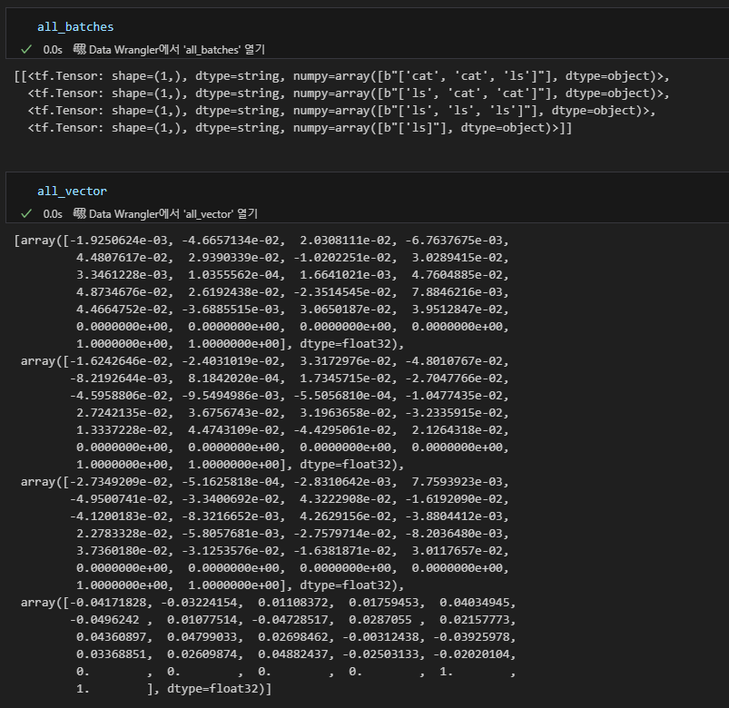

Embedding으로 진행한 결과
<figure>
  
  <figcaption><em>테스트 1. Embedding 테스트 결과</em></figcaption>
</figure>
 
 
DynamicEmbedding으로 진행한 결과
<figure>
  
  <figcaption><em>테스트 2. DynamicEmbedding 테스트 결과</em></figcaption>
</figure>
 
 
결과: 순서 변경된 것은 모두 다른 Embedding_Vector 생성, 수가 다른 것은 Embedding의 경우 다른 것으로 생성, Dynamic의 경우 동일로 생성
